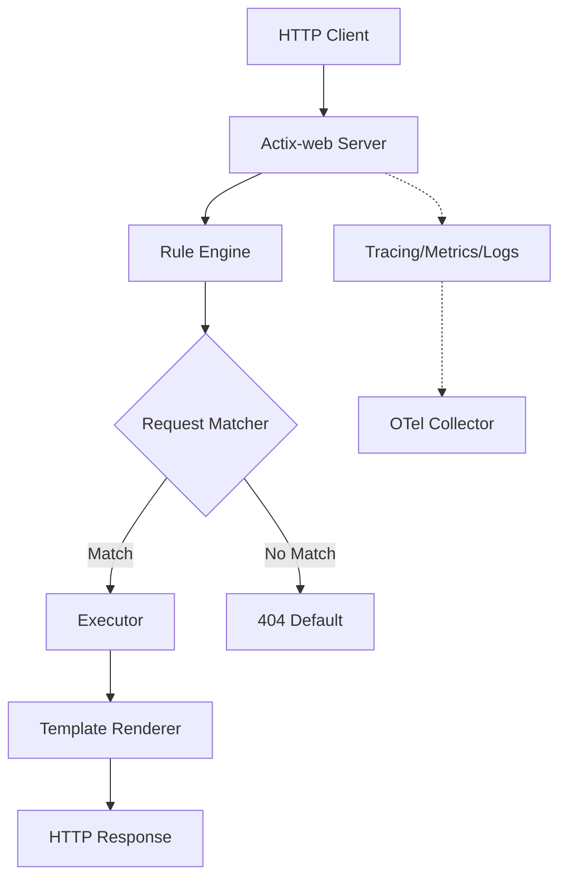

# Molock - High-Performance Mock Server

Molock is a production-ready mock server designed for high-throughput environments, CI/CD pipelines, and stress testing. Built in Rust with Actix-web, it provides configurable and observable mock endpoints with native OpenTelemetry integration.

[](https://slsa.dev/spec/v1.0/levels)
[](LICENSE)

## 🏛️ Core Pillars

Molock is built on three foundational pillars:

1.  🚀 **Extreme Performance**: Leveraging Rust and Actix-web for zero-allocation hot paths and maximum throughput (>10k req/s).
2.  🔭 **Native Observability**: OpenTelemetry is a first-class citizen, providing out-of-the-box traces, metrics, and logs.
3.  🛡️ **Rigorous Quality**: Developed using strict Test-Driven Development (TDD) with >80% line/branch coverage and SLSA Level 2 supply chain security.

## 🏗️ Architecture

Molock follows a modular architecture designed for speed and extensibility:



## ✨ Features

- **High Performance**: Built for speed and stability under high concurrency.
- **Dynamic Rules**: Match requests by Method, Path (with params), Headers, Query, and Body.
- **Response Control**: Failure injection (probability), fixed/random delays, and custom headers.
- **Resilience Testing**: Native support for simulating flaky services and retry patterns using stateful rules.
- **Stateful Logic**: Per-client state counters for simulating retry patterns.
- **Hot Reload**: Automatic configuration reloading without server restart.
- **Docker & Helm Ready**: Optimized container images and Helm Charts for Kubernetes deployment.

## 🚀 Quick Start

### Prerequisites
- Rust 1.70+
- Docker & Docker Compose (for the observability stack)

### Installation

```bash
# Clone the repository
git clone https://github.com/fike/molock.git
cd molock

# Build and run
make build
make run
```

### Kubernetes Deployment (Helm)

If you have a Kubernetes cluster, you can deploy Molock using the provided Helm chart:

```bash
helm install my-molock ./deployment/molock
```

### Immediate Usage

Test the default configuration with `curl`:

```bash
# Health check (with dynamic timestamp)
curl http://localhost:8080/health

# Path parameter matching
curl http://localhost:8080/users/123

# Regex/Condition matching (triggers 404)
curl http://localhost:8080/users/unknown
```

## ⚙️ Configuration

Molock uses YAML for configuration. A simple example:

```yaml
server:
  port: 8080
  workers: 4

endpoints:
  - name: "Get User"
    method: GET
    path: "/users/:id"
    responses:
      - status: 200
        delay: 50ms
        body: '{"id": "{{id}}", "name": "John Doe"}'
      - status: 404
        condition: "id == 'unknown'"
        body: '{"error": "not found"}'
```

See [config/molock-config.yaml](config/molock-config.yaml) for a comprehensive reference of all features including templating, stateful logic, and telemetry settings.

## 🔭 Observability

Molock integrates deeply with the OpenTelemetry ecosystem:

- **Traces**: Full request lifecycle spans exported via OTLP.
- **Metrics**: Prometheus-compatible metrics for throughput, latency, and error rates.
- **Logs**: Structured JSON logging with trace context correlation.

### Local Monitoring Stack

Start the provided stack to visualize performance:

```bash
docker-compose -f deployment/docker-compose.yml up -d
```

- **Jaeger**: [http://localhost:16686](http://localhost:16686)
- **Prometheus**: [http://localhost:9090](http://localhost:9090)
- **Grafana**: [http://localhost:3000](http://localhost:3000) (Includes pre-built Molock dashboards)

## 📊 Performance Benchmark

Molock delivers **10x higher throughput** than Java-based alternatives (like MockServer) while maintaining stability under 300+ concurrent connections.

| Scenario | Tool | Concurrency | Req/sec | P95 Latency |
| :--- | :--- | :---: | :---: | :---: |
| **Health Check** | **Molock** | 100 | **12,086** | 13ms |
| | MockServer | 100 | 1,222 | 223ms |
| **User Retrieval**| **Molock** | 300 | **9,528** | 52ms |
| | MockServer | 300 | 0 (Failed) | N/A |

For detailed methodology, see [BENCHMARKING.md](BENCHMARKING.md).

## 🛠️ Development

### Building and Testing

```bash
make build          # Build release binary
make test           # Run unit and integration tests
make test-coverage  # Generate coverage report (requires tarpaulin)
make lint           # Run clippy and format checks
```

### Contributing

We follow strict TDD principles. Please read [CONTRIBUTING.md](CONTRIBUTING.md) for our workflow, quality standards, and branch protocol.

### Technical Documentation

- **ADRs**: See [docs/adr/](docs/adr/) for architectural decisions.
- **API Docs**: API documentation is available on [docs.rs/molock](https://docs.rs/molock).
- **User Guide**: Detailed documentation and tutorials are available at [https://fike.github.io/molock/](https://fike.github.io/molock/).

## ⚖️ License

Molock is licensed under the Apache License, Version 2.0. See [LICENSE](LICENSE) for details.

---
*Molock Team - 2026*
