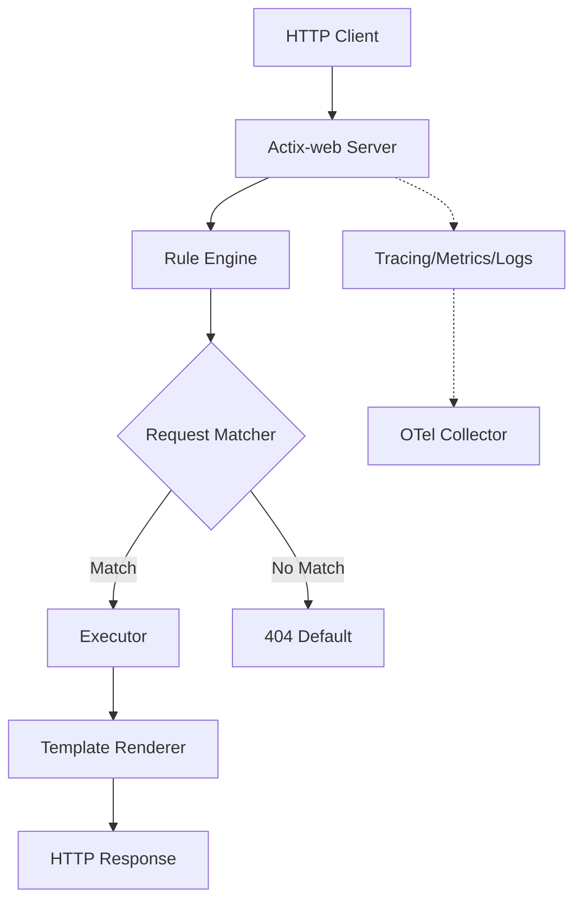

# Introduction

Molock is a production-ready mock server designed for high-throughput environments, CI/CD pipelines, and stress testing. Built in Rust with Actix-web, it provides configurable and observable mock endpoints with native OpenTelemetry integration.

## 🏛️ Core Pillars

Molock is built on three foundational pillars:

1.  🚀 **Extreme Performance**: Leveraging Rust and Actix-web for zero-allocation hot paths and maximum throughput (>10k req/s).
2.  🔭 **Native Observability**: OpenTelemetry is a first-class citizen, providing out-of-the-box traces, metrics, and logs.
3.  🛡️ **Rigorous Quality**: Developed using strict Test-Driven Development (TDD) with >80% line/branch coverage and SLSA Level 2 supply chain security.

## 🏗️ Architecture

Molock follows a modular architecture designed for speed and extensibility:

